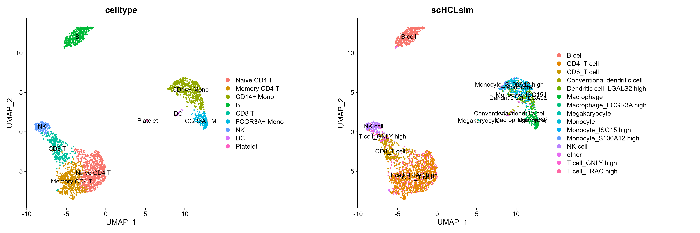
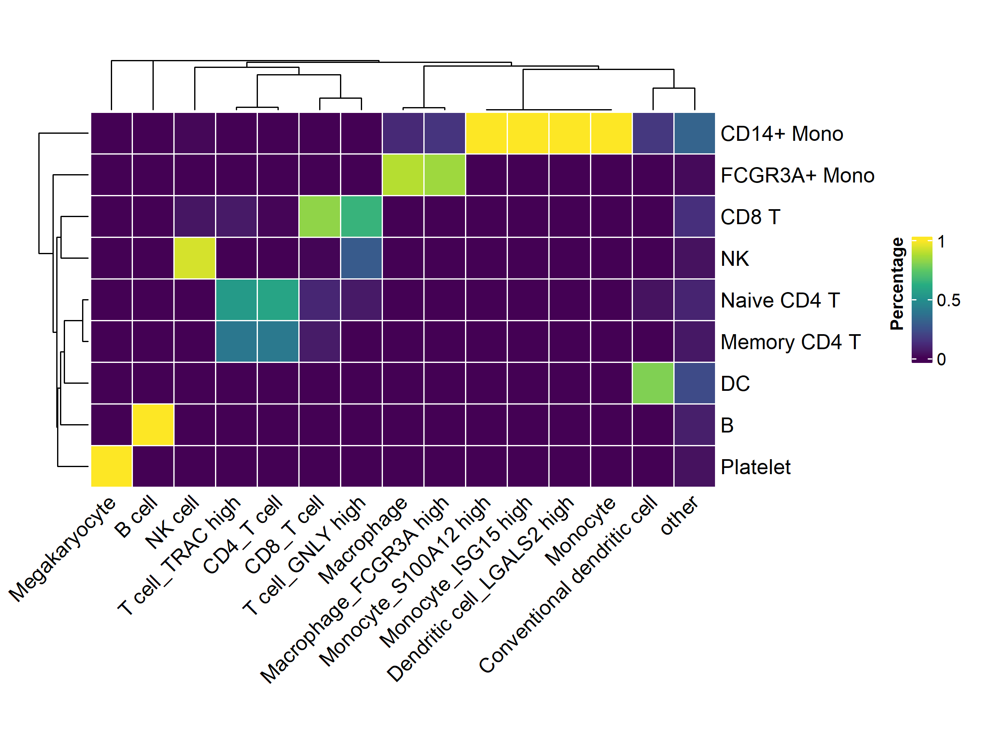

# scHCLlite

**A simplized version of R package scHCL, only keep *scHCL* function and make it much faster!**

The origianl R package scHCL is [here](https://github.com/ggjlab/scHCL), reference data used form [Human Cell Landscape](http://bis.zju.edu.cn/HCL/) project.

### Installation

```R
# devtools required
> install.packages("devtools")
> devtools::install_github("sajuukLyu/scHCLlite")
```

### Quick Start

Take `pbmc3k` dataset from `SeuratData` for example.

```R
> library(scHCLlite)
> library(Seurat)
> library(tidyverse)
> library(magrittr)

> data(pbmc3k)
> pbmc3k
# An object of class Seurat 
# 13714 features across 2638 samples within 1 assay 
# Active assay: RNA (13714 features, 2000 variable features)
#  2 layers present: counts, data
#  2 dimensional reductions calculated: pca, umap
```

Like scHCL, scHCLlite requires parameter `scdata`,  the query dataset, normalized single-cell gene expression matrix-like object with each row a gene and each column a cell. The reference dataset now should be input as a parameter.

```R
> data("ref.expr")

> hcl_test <- pbmc3k[["RNA"]]$data
> dim(hcl_test)
# [1] 13714  2638

> hcl_result <- scHCLlite(scdata = hcl_lung, num = 3, ref.expr = ref.expr)
# 2419 genes used, calculating correlation coefficient...
# 80 types expected, extracting top 3 results...
```

The return of scHCLlite() is a list which contains 4 parts, very similar to scHCL().

- cors_matrix: the pearson correlation coefficient matrix of each cell and cell type.
- top_cors: equals to `num`.
- scHCL: the most relevant cell type for each query cell.
- scHCL_similarity: the top n relevant cell types for each query cell.

```R
> hcl_result$scHCL %>% table %>% length
# [1] 46
```

There is always too much annotated celltypes with only few cells, we can simplify the results for better usage.

```R
> hcl_sim <- hcl_result$scHCL %>% str_remove("\\:.*")
> hcl_sim[hcl_sim %in% (table(hcl_sim) %>% {names(.)[. <= 10]})] <- "other"
> hcl_sim %>% table %>% length
# [1] 15

> pbmc3k$scHCLsim <- hcl_sim
```

### Performance

scHCLlite annotations are similar to original celltype annotations. 





scHCLlite runs more than 20 times faster than scHCL with the same input dataset (2600 cells).  scHCLlite can save much more time with larger input dataset.

```R
> system.time(scHCLlite(scdata = hcl_test, num = 3, ref.expr = ref.expr))
#  user    system  elapsed 
#  3.55   0.03   8.06
> system.time(scHCL(scdata = hcl_test, numbers_plot = 3))
#  user    system  elapsed 
#  60.35   29.15   207.29
```

